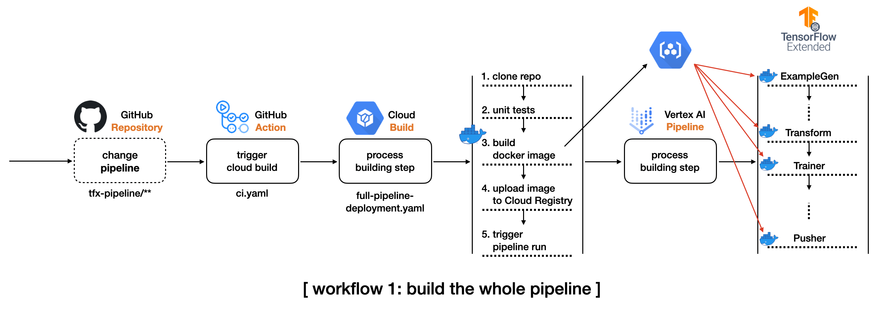
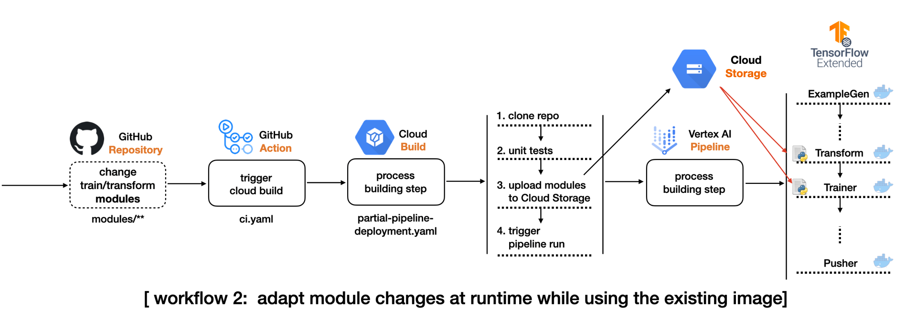

# Model Training as a CI/CD System

This project demonstrates the machine model training as a CI/CD system in GCP platform. You will see more detailed workflow in the below section, but it is about rebuilding and redeploying (continuous integration) the currently deployed machine learning pipeline based on changes in code. Such changes could happen in the training data, data pre-processing logic, model architecture and training code, custom pipeline components, and so on.

An accompanying blog post for this project is available on Google Cloud: [Model training as a CI/CD system: Part I](https://cloud.google.com/blog/topics/developers-practitioners/model-training-cicd-system-part-i). Part II can be found [here](https://cloud.google.com/blog/topics/developers-practitioners/model-training-cicd-system-part-ii) (code: [sayakpaul/
CI-CD-for-Model-Training](https://github.com/sayakpaul/CI-CD-for-Model-Training)).

## Workflow #1

1. We create initial code, or we make some changes in the existing codebase for pipeline.

2. Based on the changes in the step 2, a GitHub action gets triggered to initiate a Cloud Build process.

3. The Cloud Build runs unit tests to see if those components work without errors.

4. If there is no error at all, there are two common sub-workflows from this point.
    - Cloud Build containerizes the current codebase. This is an optional step. If you have any custom components unchanges, this step might be omitted.
      - The Cloud Build compiles a new pipeline. It creates an updated docker image, and it uploads the new docker image to GCR 
    - If there is any codes changed in data preprocessing, modeling, training steps, we only have to upload those source files to designated GCS bucket

5. The final step of the Cloud Build is to execute a pipeline run on Vertex AI

## Workflow #2

## Workflow in a nutshell 

1. We create initial code, or we make some changes in the existing codebase for modules.

2. Based on the changes in the step 2, a GitHub action gets triggered to initiate a Cloud Build process.

3. The Cloud Build runs unit tests to see if those components work without errors.

4. If there is no error at all, there are two common sub-workflows from this point.
    - If there is any codes changed in data preprocessing and models, we only have to upload those source files to designated GCS bucket.

5. The final step of the Cloud Build is to execute a pipeline run on Vertex AI. Trainer and Transform TFX components will look up the changed modules accordingly.

## Acknowledgements

[ML-GDE program](https://developers.google.com/programs/experts/) for providing GCP credits. Thanks to [Karl Weinmeister](https://twitter.com/kweinmeister) for providing review feedback on this project.
