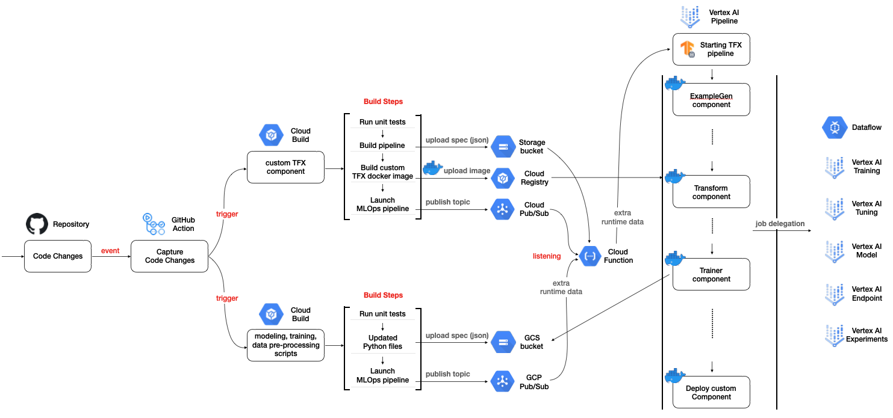

# Model Training as a CI/CD System

This project demonstrates the machine model training as a CI/CD system in GCP platform. You will see more detailed workflow in the below section, but it is about rebuilding and redeploying (continuous integration) the currently deployed machine learning pipeline based on changes in code. Such changes could happen in the training data, data pre-processing logic, model architecture and training code, custom pipeline components, and so on.

## Workflow in a nutshell 

1. We create a Pub/Sub topic, and then we can deploy a Cloud Function to be triggered by listening to the topic. In the 7th step, we publish a topic with a custom data(optional). This first step ensures that we can create a pipeline run by detecting any changes of our interests. 

2. We create initial code, or we make some changes in the existing codebase.

3. Based on the changes in the step 2, a GitHub action gets triggered to initiate a Cloud Build process.

4. The Cloud Build runs unit tests to see if those components work without errors.

5. If there is no error at all, there are two common sub-workflows from this point.
    - Cloud Build containerizes the current codebase. This is an optional step. If you have any custom components unchanges, this step might be omitted.
      - The Cloud Build compiles a new pipeline. It will create an updated docker image, then get the pipeline spec in JSON.
      - The Cloud Build uploads the JSON to GCS bucket, and upload the new docker image to GCR 
    - If there is any codes changed in data preprocessing, modeling, training steps, we only have to upload those source files to designated GCS bucket

6. The final step of the Cloud Build is to publish Pub/Sub topic with custom data(i.e. hyper-parameters)

7. Cloud Function from the 1st step gets triggered by receiving the Pub/Sub topic, and a new pipeline run will be executed.

## Acknowledgements

[ML-GDE program](https://developers.google.com/programs/experts/) for providing GCP credits.
